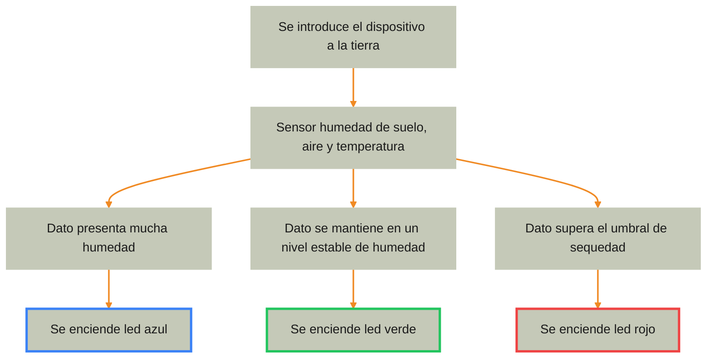

## Hipótesis a prueba

### Cadena de sensado

**Sequedad ambiental** → **Humedad y temperatura** → **Sensor** → **% / °C** → **Nivel de sequedad** → **Alerta**

### Diagrama de flujo

```mermaid
flowchart TD
    A["Se introduce el dispositivo a la tierra"] --> B["Sensor humedad de suelo, aire y temperatura"]

    B --> C["Dato presenta mucha humedad"]
    B --> D["Dato se mantiene en un nivel estable de humedad"]
    B --> E["Dato supera el umbral de sequedad"]

    C --> F["Se enciende led azul"]
    D --> G["Se enciende led verde"]
    E --> H["Se enciende led rojo"]

    classDef paso fill:#c5c9b8,stroke:#c5c9b8,color:#1a1a1a;
    classDef azul fill:#c5c9b8,stroke:#3b82f6,stroke-width:3px,color:#1a1a1a;
    classDef verde fill:#c5c9b8,stroke:#22c55e,stroke-width:3px,color:#1a1a1a;
    classDef rojo fill:#c5c9b8,stroke:#ef4444,stroke-width:3px,color:#1a1a1a;

    class A,B,C,D,E paso;
    class F azul;
    class G verde;
    class H rojo;

    linkStyle default stroke:#f08a24,stroke-width:2px;
```
