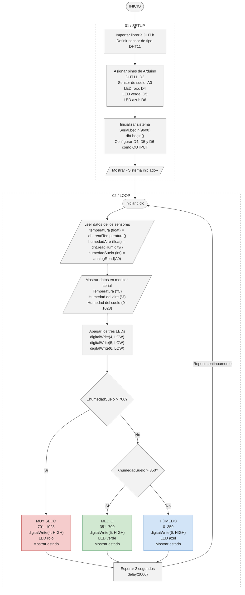

## Diagrama de flujo completo — Umbral Seco


```mermaid
flowchart TD
    A([INICIO])

    subgraph SETUP["01 / SETUP"]
        B["Importar librería DHT.h<br/>Definir sensor de tipo DHT11"]
        C["Asignar pines de Arduino<br/>DHT11: D2<br/>Sensor de suelo: A0<br/>LED rojo: D4<br/>LED verde: D5<br/>LED azul: D6"]
        D["Inicializar sistema<br/>Serial.begin(9600)<br/>dht.begin()<br/>Configurar D4, D5 y D6 como OUTPUT"]
        E[/"Mostrar «Sistema iniciado»"/]
        B --> C --> D --> E
    end

    subgraph LOOP["02 / LOOP"]
        F([Iniciar ciclo])
        G[/"Leer datos de los sensores<br/>temperatura (float) = dht.readTemperature()<br/>humedadAire (float) = dht.readHumidity()<br/>humedadSuelo (int) = analogRead(A0)"/]
        H[/"Mostrar datos en monitor serial<br/>Temperatura (°C)<br/>Humedad del aire (%)<br/>Humedad del suelo (0–1023)"/]
        I["Apagar los tres LEDs<br/>digitalWrite(4, LOW)<br/>digitalWrite(5, LOW)<br/>digitalWrite(6, LOW)"]
        J{"¿humedadSuelo > 700?"}
        K{"¿humedadSuelo > 350?"}

        L["MUY SECO<br/>701–1023<br/>digitalWrite(4, HIGH)<br/>LED rojo<br/>Mostrar estado"]
        M["MEDIO<br/>351–700<br/>digitalWrite(5, HIGH)<br/>LED verde<br/>Mostrar estado"]
        N["HÚMEDO<br/>0–350<br/>digitalWrite(6, HIGH)<br/>LED azul<br/>Mostrar estado"]

        O["Esperar 2 segundos<br/>delay(2000)"]

        F --> G --> H --> I --> J
        J -->|Sí| L
        J -->|No| K
        K -->|Sí| M
        K -->|No| N
        L --> O
        M --> O
        N --> O
        O -->|Repetir continuamente| F
    end

    A --> B
    E --> F

    classDef neutro fill:#f2f2f2,stroke:#777777,color:#222222
    classDef seco fill:#f5cccc,stroke:#c65a59,color:#222222
    classDef medio fill:#d1e8d1,stroke:#49965f,color:#222222
    classDef humedo fill:#d2e4f7,stroke:#528fcd,color:#222222

    class A,B,C,D,E,F,G,H,I,J,K,O neutro
    class L seco
    class M medio
    class N humedo

    style SETUP fill:transparent,stroke:#999999,stroke-dasharray:5 5
    style LOOP fill:transparent,stroke:#999999,stroke-dasharray:5 5
```

---

## Código utilizado

```cpp

```
